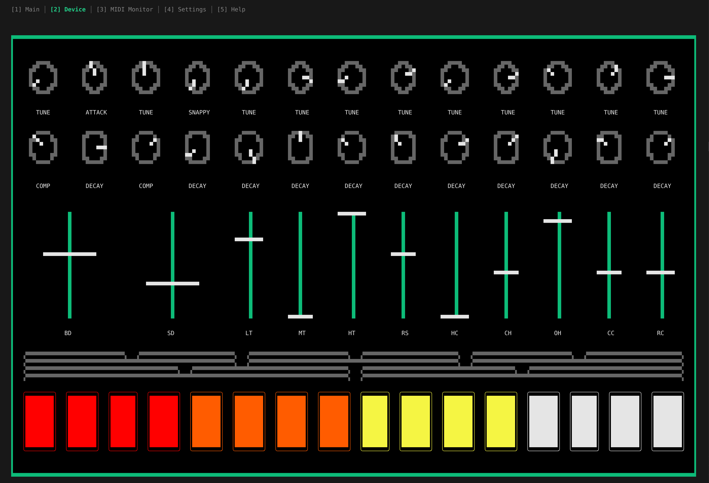

# uncycle

*A real-time MIDI tool that extends existing hardware synth capabilities.*

## Disclaimer

The project is currently in VEAS (very early alpha stage).

## Project Vision

`uncycle` aims to be an open-source, cross-platform MIDI swiss-knife designed to augment your existing hardware instruments rather than replace them. Born from the philosophy of "anti-anti-consumerism," this project helps you get more creative mileage from your current devices.

## Supported Devices

| Manufacturer | Name | MIDI monitoring | MIDI augmentation |
| ------------ | ---- | :-------------: | :---------------: |
| Roland       | TR-8 |  <li>[x]</li>   |   <li>[x]</li>    |

## TUI



### How to  Use

When the program is started, it automatically wants to recognize the Roland TR-8 (for now) and tries to connect to it. Check in `Midi Monitor` tab if it was successful.

The interface is designed to be as intuitive as possible. Suggestions on improvements are welcome!

| Keybind                        | Function          | Comment                                   |
| ------------------------------ | ----------------- | ----------------------------------------- |
| <kbd>Space</kbd>               | Start/Stop Device | Sends the actual Midi bytes               |
| <kbd>Enter</kbd> (first time)  | Record            | Knob sequence via Midi CC (over 16 steps) |
| <kbd>Enter</kbd> (after first) | Overdub           | Knob sequence via Midi CC (over 16 steps) |
| <kbd>Backspace</kbd>           | Delete recording  | Start again with Record                   |

Make sure the device is running before trying to record any CC loop.

The looping is designed to work like tape machines, where there is only one track that can be recorded and overdubbed. Once a recording has been started, the loop will be played back at all times (16 steps for now). Also, right now `uncycle-tui` will send a clock at all times. The BPM can be changed with <kbd>+</kbd> and <kbd>-</kbd> by 1. (Try holding the key down.)

### To be added (soon)

- change the loop length
- listen to external Midi clock

### Build

**Using `nix` (Recommended):**

[Install nix](https://nix.dev/install-nix.html), the package manager, on your system. You don't have to install Rust at all with this method. Entering the dev shell might take a little the very first time.
```bash
# without flakes
nix-build 
./result/bin/uncycle-tui

# with flakes
nix run 
```

**Using `cargo`:**

[Install Rust](https://rust-lang.org/tools/install/) and make sure to use at least version 1.88.0.

```bash
cargo run --release
```

## Core Library

The core library has been fully switched over to `no_std` by default and further advancement will require this. At some point (hopefully) I will provide a `cbindgen` API for crosscompiling on embedded platforms with C.

## Hardware

The long-term plan is to run this software on dedicated hardware, i.e. a small stompbox, so that a true DAW-less or PC-less setup can be achieved. Developing in a TUI is a lot less work to get going, though.

## Project Structure

```shell
uncycle/
├── core/   # platform-agnostic logic (`#![no_std]` per default)
├── fw/     # (planned) firmware for embedded device
├── tui/    # frontend and backend for PC use
└── vst/    # maybe, who knows
```